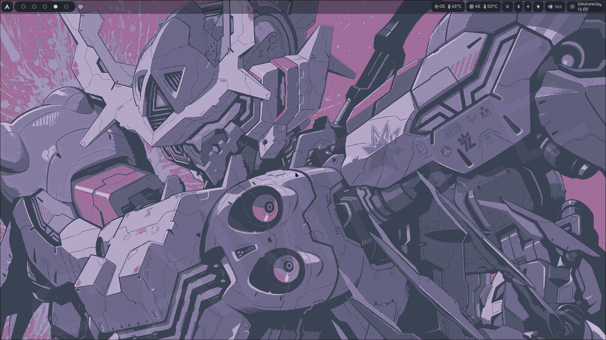
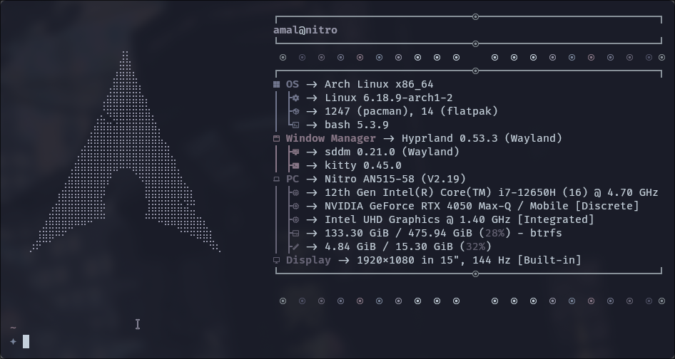

# Arch Linux Hyprland Setup

A customized Arch Linux desktop environment built with the **Hyprland Wayland compositor**, featuring a modular **Waybar interface**, hybrid GPU support, and Btrfs-based system management.

## Features

- Hyprland Wayland compositor
- Custom Waybar layout
- Intel + NVIDIA hybrid graphics configuration
- Btrfs filesystem with snapshot support
- systemd-boot bootloader
- Modular configuration files

## Screenshots

### Desktop

### Waybar

### Terminal

## System Details

| Component | Tool |
|--------|--------|
| OS | Arch Linux |
| Window Manager | Hyprland |
| Status Bar | Waybar |
| Terminal | Kitty |
| Launcher | Rofi |
| Notifications | Mako |
| Clipboard | Cliphist |
| Wallpaper | swww |
| Filesystem | Btrfs |

## Highlights

- Custom Waybar UI with vertical system bar
- Hybrid graphics configuration for Wayland
- Btrfs snapshot strategy using Timeshift
- Modular and reproducible configuration files

